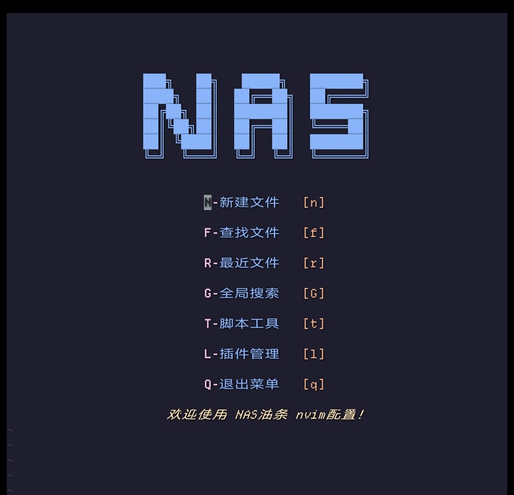

# neoniv-config

基于 [nasyt233/nasyt-nvim](https://github.com/nasyt233/nasyt-nvim) 的 Neovim 配置，
在原配置基础上**补齐了完整的 LSP 语言服务**（TypeScript / React / Vue / C# / Web）。



- 插件管理：lazy.nvim（52 个插件，版本锁定在 `lazy-lock.json`）
- 文件树 / 标签页：nvim-tree + bufferline（真实图标 real-icons.nvim）
- 补全：nvim-cmp + LuaSnip + friendly-snippets
- 主题：catppuccin（`<leader>z` 切换 Themify）
- 语言服务：vtsls、vue_ls、OmniSharp、html、cssls、jsonls、eslint、tailwindcss、emmet

---

## 1. 新机器上一键装好

前提：Debian / Ubuntu / Mint，已装 `curl`、`git`、`node`/`npm`；C# 需要 `dotnet` SDK。

```bash
# 1) 取配置
git clone git@github.com:W0derful/neoniv-config.git ~/.config/nvim

# 2) 装外部程序（Neovim 本体、ripgrep、fd、xclip、lazygit、
#    ImageMagick、各语言 LSP、格式化器）—— 全部装到 ~/.local，不用 sudo
cd ~/.config/nvim
./install.sh

# 3) 首次启动，lazy.nvim 会自动把插件装好（等它跑完即可）
nvim
```

> `install.sh` 是幂等的：已经装好的会跳过；加 `--upgrade` 可把已有程序更新到最新版。

## 2. 快速上手

| 操作 | 按键 |
| --- | --- |
| Leader 键 | `空格` |
| 找文件 / 全文搜索 / 最近文件 | `<leader>ff` / `<leader>fg` / `<leader>fr` |
| 文件树 | `<leader>e` |
| 打开终端 | `<leader>/` 或 `Ctrl+\` |
| 保存 / 退出 | `<leader>w` / `<leader>q` |
| 退出插入模式 | `jj` |
| 悬浮文档 | `K` |
| 跳转定义 / 查看引用 | `gd`（Glance）/ `gR` |
| 代码动作 / 重命名 | `<leader>ca` / `<leader>rn` |
| 格式化当前文件 | `<leader>lf`（保存时也会自动格式化） |
| 上/下一处报错 | `[d` / `]d` |
| Git | `<leader>gg`（LazyGit） |
| 跳转（flash） | `s` |
| 主题 | `<leader>z` |

## 3. LSP 语言服务

| 语言 / 文件 | 服务 | 说明 |
| --- | --- | --- |
| TS / JS / React (tsx/jsx) | **vtsls** | 类型检查、补全、重构 |
| Vue (`.vue`) | **vue_ls** + **vtsls** | 通过 `@vue/typescript-plugin` 支持 `<script setup lang="ts">` |
| C# | **OmniSharp** | 需系统有 `dotnet` SDK |
| HTML / CSS / JSON | html / cssls / jsonls | |
| ESLint / Tailwind / Emmet | eslint / tailwindcss / emmet_language_server | 需项目里自带对应配置 |

查状态：

```vim
:LspInfo               " 当前 buffer 挂了哪些服务
:checkhealth vim.lsp
:ConformInfo           " 格式化器状态
```

服务配置在 `lua/plugins/lsp.lua`，需要时再改它。

### 类型提示（inlay hints）

Neovim 0.10+ 内置，配置里的 `inlay-hints.nvim` 会在 LSP 挂载时自动开启。
推断出的类型会以灰色小字显示在变量/参数旁边，例如 `const count = 42` 后面显示 `: number`。

临时开关：

```vim
:InlayHintsToggle
:InlayHintsEnable
:InlayHintsDisable
```

各语言支持情况（取决于对应 LSP 是否实现 `textDocument/inlayHint`）：

| 语言 | 服务 | 类型提示 |
| --- | --- | --- |
| TS / JS / React | vtsls | ✅ 需要在 `lsp.lua` 里设置 `typescript.inlayHints.*`（已配好） |
| Rust | rust-analyzer | ✅ 支持很好 |
| Vue | vue_ls + vtsls | ⚠️ 部分 |
| C# | OmniSharp | ❌ 不支持（OmniSharp 未实现该协议；想要就得换 Roslyn LSP） |
| HTML / CSS / JSON / ESLint / Tailwind / Emmet | — | ❌ 这些服务不提供 |

## 4. 插件管理（lazy.nvim）

插件版本锁在 `lazy-lock.json`，升级后记得把它提交回仓库。

```vim
:Lazy              " 打开管理界面
"   界面里：u 更新当前插件 / U 全部更新 / S 同步 / R 恢复锁定版本 / X 清理 / c 检查

:Lazy update       " 更新所有插件到最新（会改写 lazy-lock.json）
:Lazy update foo   " 只更新某个插件
:Lazy sync         " 安装缺失的 + 更新
:Lazy check        " 只检查有没有新版本
:Lazy restore      " 按 lazy-lock.json 还原到锁定版本（装回作者测试过的版本）
:Lazy clean        " 删除已不再使用的插件
```

推荐流程：`:Lazy update` → 用几天没问题 → `git add lazy-lock.json && git commit -m "update plugins" && git push`。

## 5. 外部程序升级

```bash
cd ~/.config/nvim
./install.sh --upgrade      # 一条命令升级全部（Neovim、LSP、格式化器等）
```

单独升级：

```bash
# LSP / prettier（npm 全局）
npm update -g typescript typescript-language-server @vtsls/language-server \
  @vue/language-server @vue/typescript-plugin vscode-langservers-extracted \
  @tailwindcss/language-server @olrtg/emmet-language-server prettier
# 格式化器
pipx upgrade black && pipx upgrade isort
```

> **重要**：`npm update -g` 或重装 `@vue/language-server` 会清掉它内部那份 TypeScript 5，
> 导致 Vue 语言服务崩溃。**升级完 npm 包后重跑一次 `./install.sh`** 即可自动修好。

## 6. 注意事项（踩坑记录）

1. **剪贴板**：配置设了 `clipboard = "unnamedplus"`，必须有 `xclip`（已装）才能 yank 到系统剪贴板。
2. **`magick` 是封装**：系统仓库只有 ImageMagick 6（没有 IM7 的 `magick`），
   `~/.local/bin/magick` 是个封装脚本，调用解包在 `~/.local/opt/imagemagick6` 的 IM6，
   SVG 交给 `rsvg-convert` 解码；real-icons.nvim 靠它转换图标。
3. **TypeScript 版本**：全局 `tsc` 是 7.x（原生版，只有命令行、没有库 API），
   而 `vtsls` 自带 TS、`vue_ls`/`ts_ls` 使用各自内部内置的 TypeScript 5.9 —— 互不干扰。
4. **不要同时启用 `ts_ls` 和 `vtsls`**（官方明确不建议），本配置统一用 `vtsls`。
5. **真实图标**：real-icons 在支持内联图片的终端（kitty、sixel 等）才显示真图，
   其它终端自动退化成字形图标，不影响使用。
6. **Go 没装**：`conform` 里配了 `gofmt/goimports`，但机器上没有 Go 工具链，
   所以 Go 文件不会被格式化；装了 Go 之后自动生效。
7. **可忽略的 warning**：`:checkhealth` 里关于 Python/Node/Perl provider、
   额外 treesitter parser（html/yaml/latex）、`site/pack/core` 的提示都不影响使用。
8. **rust-analyzer 的坑**：`~/.cargo/bin/rust-analyzer` 只是 rustup 的代理壳，
   文件存在 ≠ 能用。如果当前 toolchain 没装该组件，执行会报
   `error: Unknown binary 'rust-analyzer'`，Rust 的补全/跳转/提示会**全部失效**，
   但 `vim.fn.executable()` 依然返回 1，很容易误判。修复：
   `rustup component add rust-analyzer`（`./install.sh` 已包含并会真正执行校验）。

## 7. 目录结构

```
~/.config/nvim
├── init.lua                # 入口：leader、keymaps、options、lazy
├── install.sh              # 用户级依赖安装/升级（无需 sudo）
├── lazy-lock.json          # 插件版本锁
├── lua/
│   ├── config/
│   │   ├── keymaps.lua     # 快捷键（含 LSP 快捷键函数）
│   │   ├── options.lua     # 编辑器选项
│   │   └── lazy.lua        # lazy.nvim 引导
│   ├── plugins/            # 每个插件一个文件；lsp.lua 是语言服务配置
│   ├── ftdetect/ syntax/   # 自定义 ngal 文件类型与语法
│   └── nasyt.lua           # 启动横幅
└── demonstrate/            # 演示图片
```

## 8. 许可证

MIT License © 2026

原始配置来自 [nasyt233/nasyt-nvim](https://github.com/nasyt233/nasyt-nvim)（MIT），
本仓库在其基础上增加了 LSP 配置与本说明。
